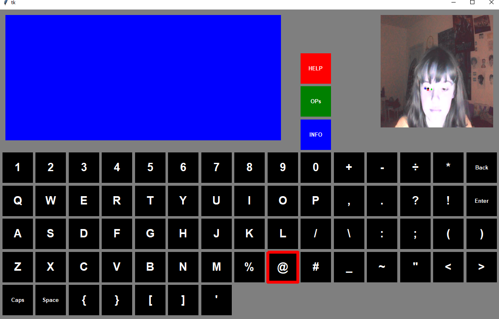

# Gaze Estimation Project (Research Project)

This repository contains the technical documentation a project where I designed
an assistive technology application using Python, OpenCV, and dlib.

The application enables users to type using a virtual keyboard controlled via gaze estimation and blink detection
through a standard webcam.

📄 [Read the full report](https://github.com/Jessieweneedtocook/Gaze_Estimation/raw/main/docs/GAZE_ESTIMATION_PROJECT.pdf)

---
*Note: The original project was developed as a prototype and is not open-sourced here, 
but the report details the algorithms, design process, and evaluation.*
